# Programación y Plataformas Web

**Estudiante:** Claudia Quevedo

**Correo:** 📧 [Claudia Quevedo](cquevedor@est.ups.edu.ec)

💻 **GitHub:** [Claudia Quevedo](https://github.com/clcmono/icc-ppw-framework-backend-fundamentos.git)

## **9. Resultados y Evidencias Requeridas**

Se verificó que la base de datos se pobló correctamente con los datos de prueba, todas las funcionalidades de paginación, filtros y ordenamiento respondieron como se esperaba, y no se encontraron errores durante las pruebas.
### **9.1. Datos para revisión**

**Usar un dataset de al menos 1000 productos**:
Crear un script de carga masiva para poblar la base de datos con datos variados:
- al menos 5 usuarios
- alemnos 2 categorias por producto  
- Precios variados ($10 - $5000)
- Nombres con texto buscable

### **9.2. Evidencias de funcionamiento** Caputuras de Postman
1. **Page response**: `GET /api/products?page=0&size=5` mostrando metadatos completos
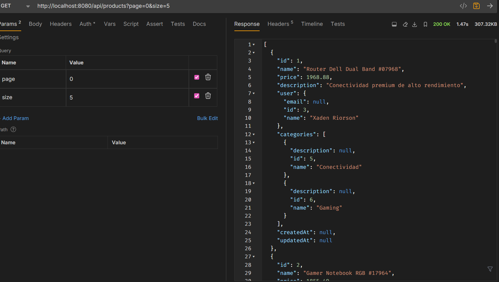

2. **Slice response**: `GET /api/products/slice?page=0&size=5` sin totalElements
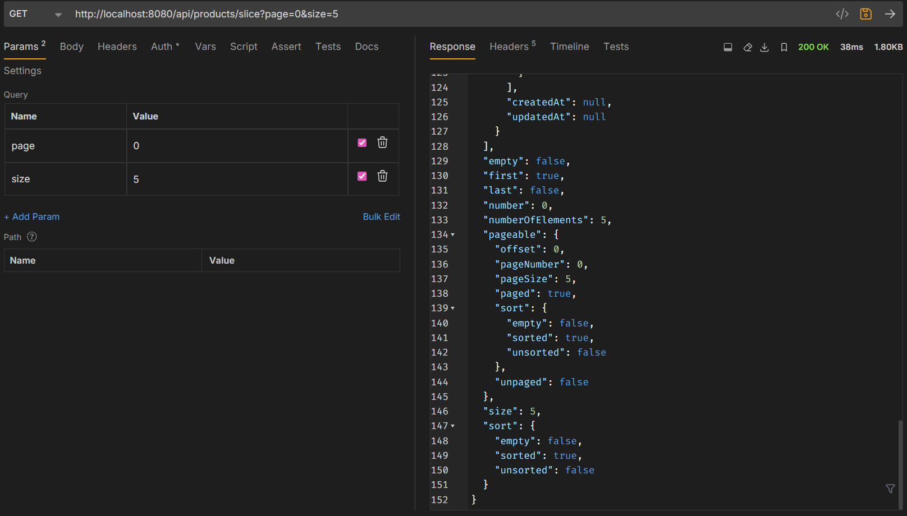

3. **Filtros + paginación**: `GET /api/products/search?name=laptop&page=0&size=3`
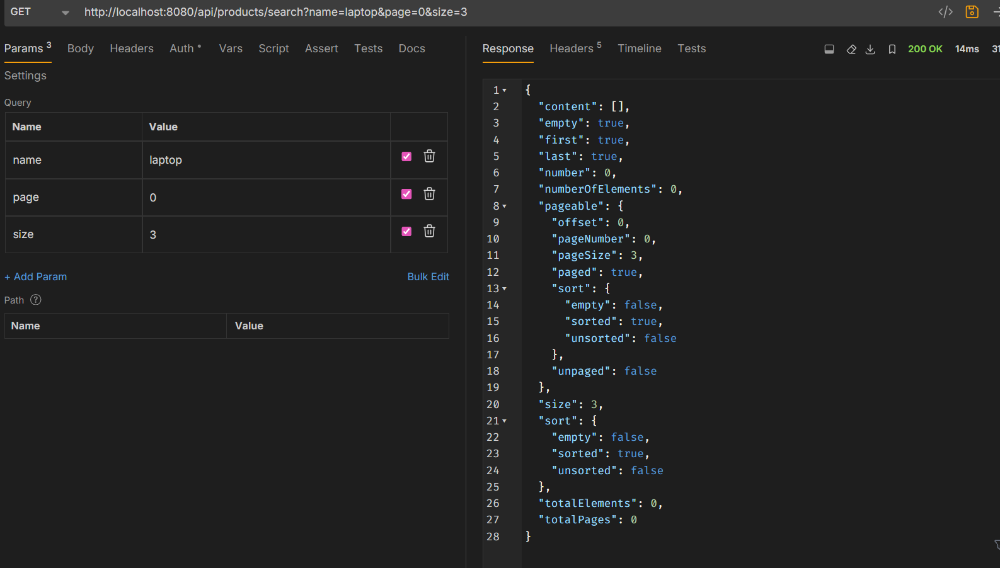

4. **Ordenamiento**: `GET /api/products?sort=price,desc&page=1&size=5`
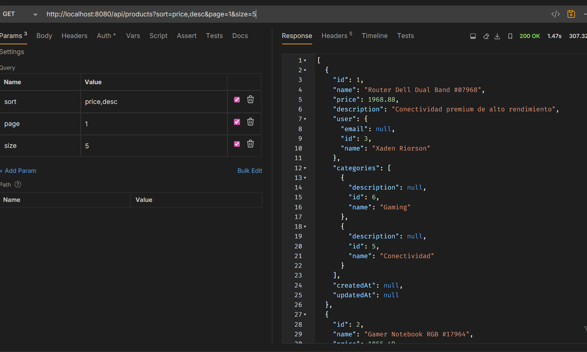

### **9.3. Evidencias de performance**
1. **Comparación**: Tiempos de respuesta Page vs Slice

**Consultas de prueba con volumen**:
 #### PAGE
1. Primera página de productos (page=0, size=10)
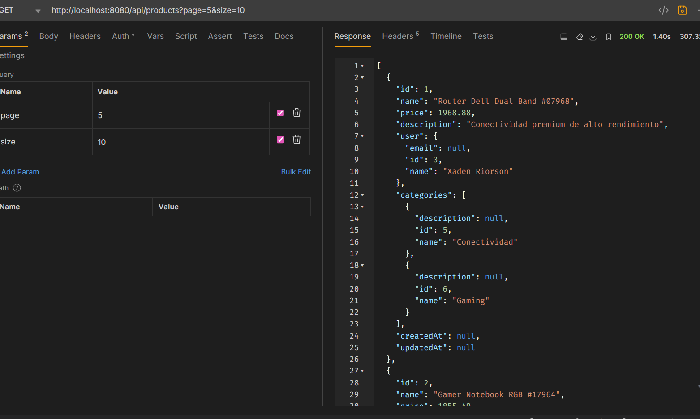
2. Página intermedia (page=5, size=10) 
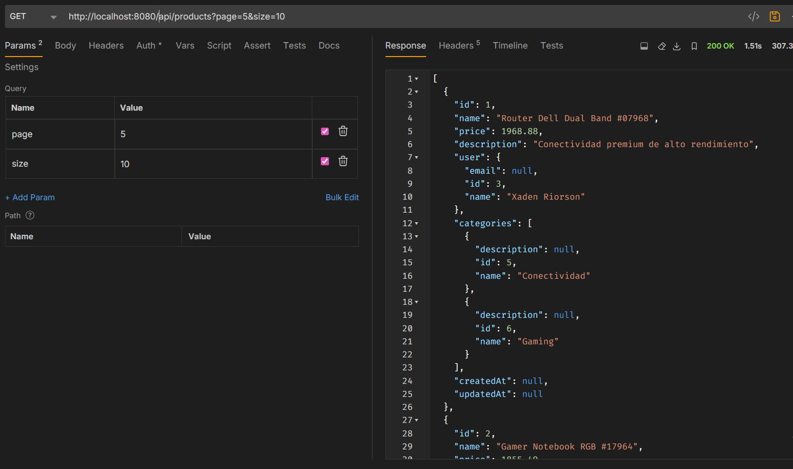
3. Últimas páginas para verificar performance
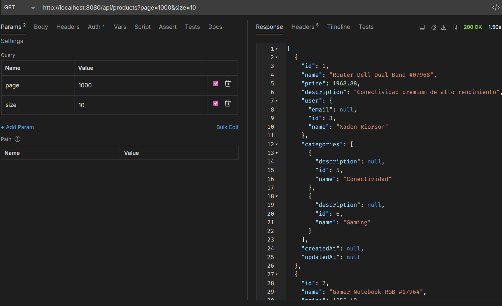
4. Búsquedas con pocos y muchos resultados
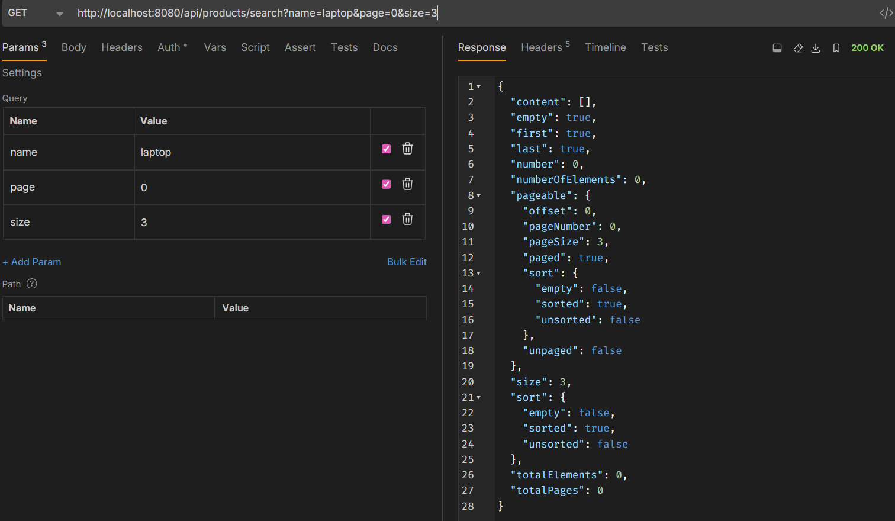
5. Ordenamiento por diferentes campos
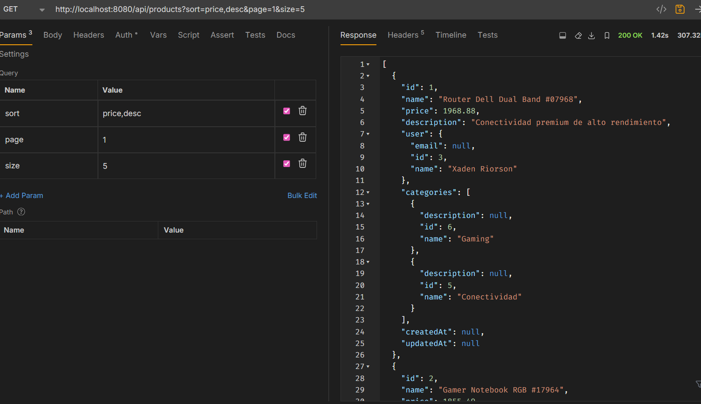
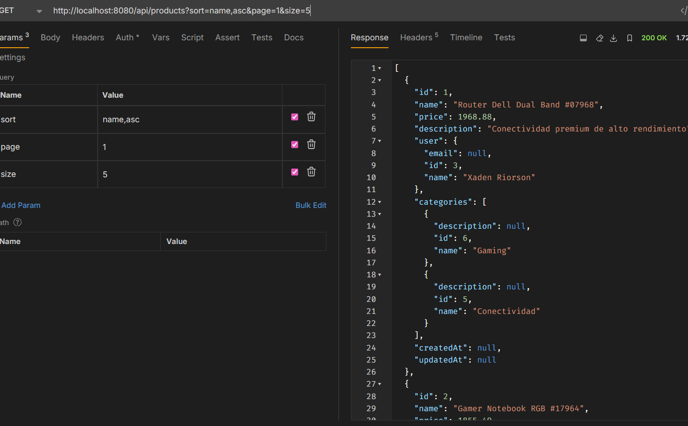

#### SLICE
**Consultas de prueba con volumen**:
1. Primera página de productos (page=0, size=10)
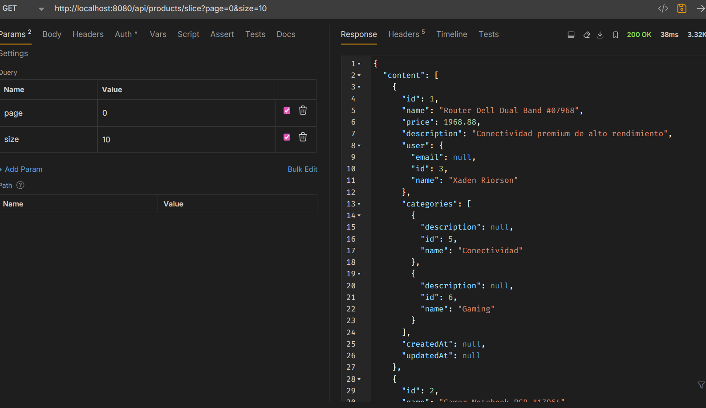
2. Página intermedia (page=5, size=10) 
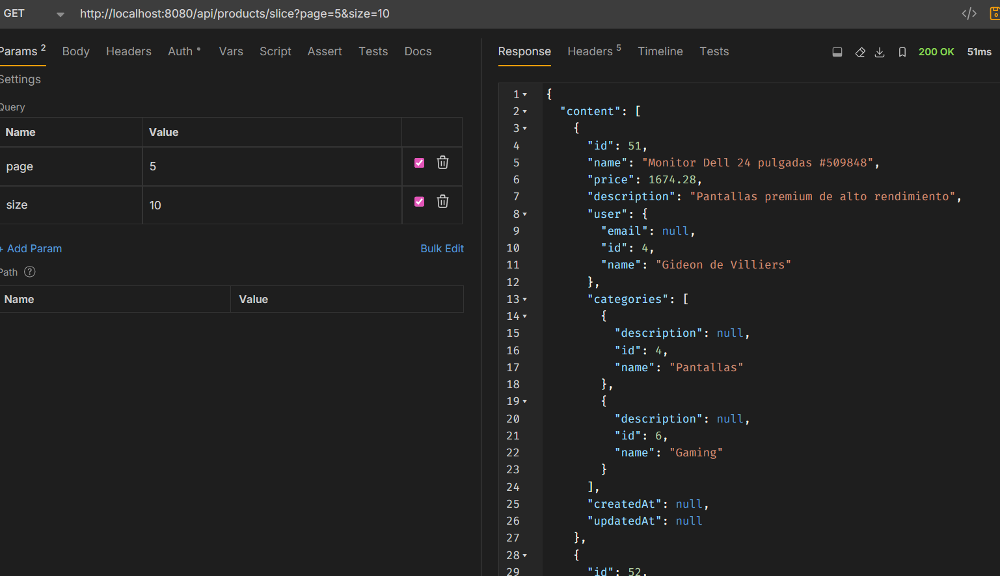
3. Últimas páginas para verificar performance
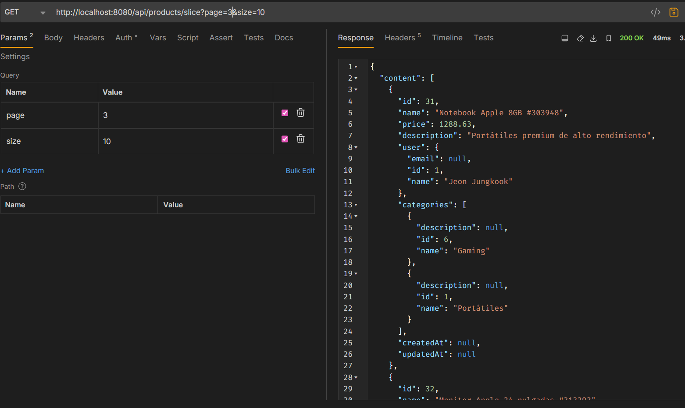
4. Búsquedas con pocos y muchos resultados
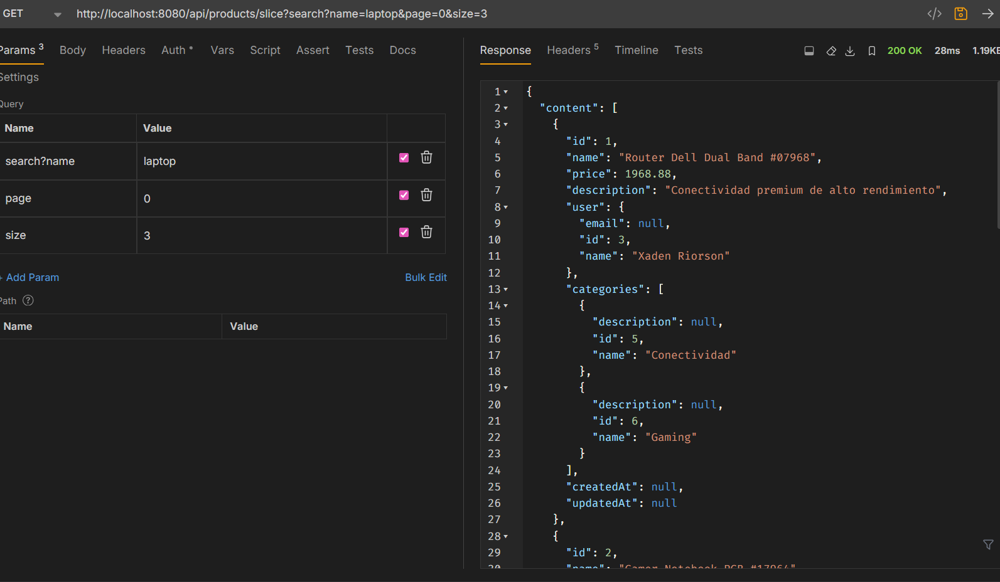
5. Ordenamiento por diferentes campos
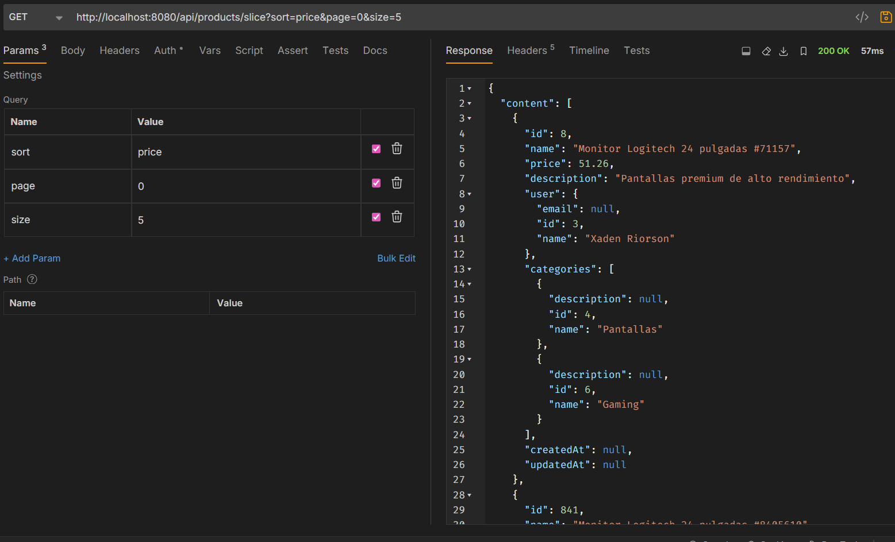
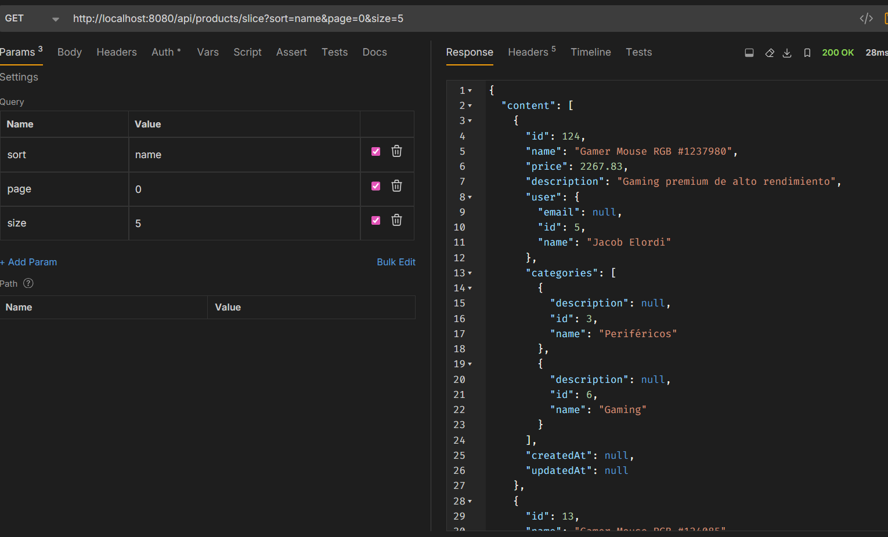
